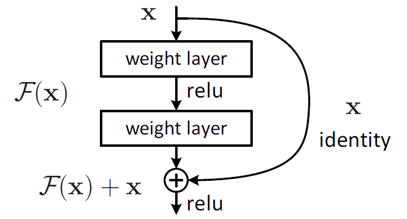
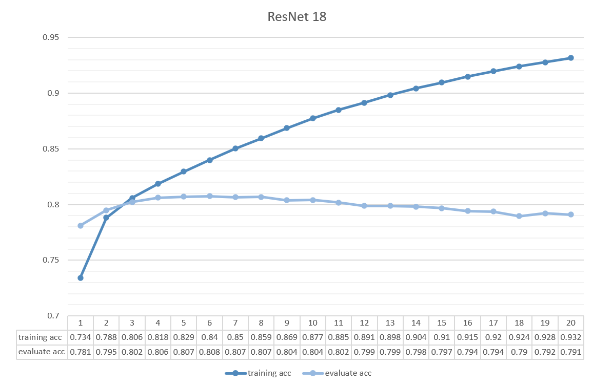
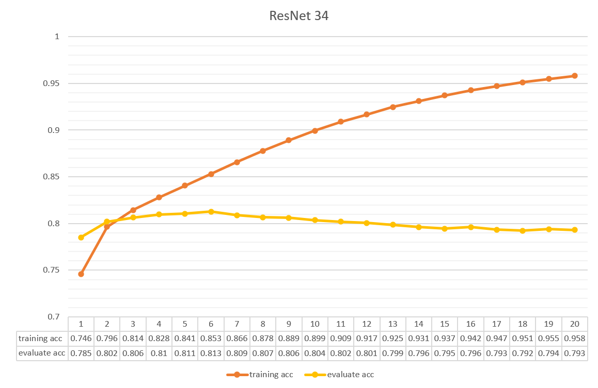
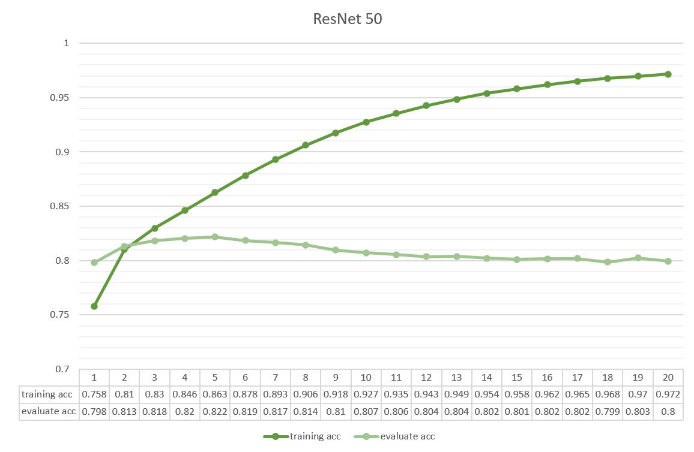

# 手绘草图分类问题

##### 林宇欣：220030910004， 胡屹垚：20030910016， 王祎雯：220030910002

## 1. 项目简介

​		手绘草图（freehand sketch）是一种形式简单但蕴含丰富信息的艺术形式，通过简洁的线条能表现出强烈的风格以及传递鲜明的信息。虽然人类能够轻松地从简笔画中获取主要的信息，但是这个任务对于机器来说非常有挑战。这种挑战主要来自于手绘草图含义的模糊性、同类对象在几何表达上的差异性，以及模型的输入图片缺乏丰富的纹理特征。因此本项目旨在实验比较不同模型对手绘草图的分类效果。本项目实践了传统分类模型和深度神经网络模型，其中传统模型包括了SVM（Support Vector Machine）、KNN（K Nearest Neighbor）和MLP（Multi Layer Perceptron）方法，深度神经网络模型包括了ResNet和VGG网络。【比较结果待补充】

## 2. 相关工作 

​		手绘草图识别的难点有3个。首先，对于相同类别的图片，人对于该类别的关键信息理解不同，并且根据直觉创造出内涵模糊的图形，这种模糊性甚至对人的识别来说也是较为困难的。其次，手绘草图根据绘画者的不同，其艺术表达风格也不同，因此同种类别下草图的表现形式差异也非常大。最后，和照片的识别相比，手绘草图没有颜色和纹理的信息，同时画面中也存在大量相同的留白，因此图像信息相对之下更稀少。

​		针对手绘草图识别任务的模型可以按照模型输入的不同分为三类。第一类是将手绘草图的分类视为图像分类任务，即模型的输入是像素图片。像素图片的分类可以用传统的分类方法，如SVM和KNN来实现。也可以用卷积神经网络进行学习和分类。早期使用卷积神经网络的方法效果并不出众的一个原因在于没有足够的数据集来支撑卷积网络的训练。而另外一个原因则是由于手绘图和照片的区别，导致为照片分类设计的卷积网络在手绘草图的分类上表现并不突出。第二类是基于笔画顺序设计的分类模型，这类模型的输入是人在绘制时按照时间先后顺序画出的线条序列。这类模型认为手绘草图的重要特性是笔画的线条和绘制的时序信息，因此选择笔画顺序为模型输入。这类模型为了利用信息中的时序信息，通常采用循环神经网络。而第三类模型是同时利用像素图像信息和笔画顺序信息进行分类，希望充分挖掘和利用手绘草图中的信息。例如Sktech-a-Net[1]，是将传统的卷积神经网络进行了修改，考虑到了人在绘制时倾向于先画总体特征，再画细节特征的习惯，因此对多层次的特征进行了提取和融合。而Sketch-R2CNN[2]则是采用了卷积神经网络和循环神经网络两个分支，使用卷积神经网络将笔画顺序特征转换为多通道的点特征，再使用卷积神经网络进行识别分类。

## 3. 数据集介绍 

​		本项目使用的数据集为QuickDraw数据集。QuickDraw数据集收集了来自Quick, Draw！游戏中用户在20秒内所画的指定类别的手绘草图。在这个数据集中，每个草图样本是以笔画顺序的形式进行存储的。草图样本由一系列点组成，每个点由5个特征$(\Delta x,\Delta y, p_1, p_2, p_3)$构成，这5个特征依次表示了当前笔画相对于上一笔画在画布上的偏移量$(\Delta x, \Delta y)$，以及当前笔画的特征状态。其中$p_1$表示了当前笔画正在接触画布，并且会与下一个点连接起来；$p_2$表示在当前笔画之后笔将被抬起；而$p_3$表示整个绘制已经结束。原始的QuickDraw数据集共有345个种类的手绘草图，每个种类下均有70000张训练集样本，2500验证集样本，和2500个测试集样本。本项目使用的数据是QuickDraw原始数据集中的25个动物草图种类，分别为牛、熊猫、狮子、老虎、浣熊、猴子、刺猬、斑马、马、猫头鹰、大象、松鼠、羊、狗、熊、袋鼠、鲸鱼、鳄鱼、犀牛、企鹅、骆驼、火烈鸟、长颈鹿、猪和猫。

​		对于原始数据的笔画序列，我们选择将其转换为28*28像素大小的png格式图片作为模型的输入。序列到图片的转换我们采用了https://github.com/CMACH508/RPCL-pix2seq中的方法。

## 4. 研究方法

### 4.1 传统分类方法

​		传统的分类方法有SVM和KNN算法，这两个方法作为经典的有监督学习模型，应用场景非常广泛，因此本项目选择采用这两个算法进行实验。其中SVM算法作为本次实验的基线实验进行测试。而MLP模型虽然作为神经网络模型区别于以上提到的两个模型，但由于他的结构相对简单，并且网络的每层之间只采用了全连接的形式，因此在本项目中把它也归入了传统的分类方式。

​		同时，为了更好地了解数据集，我们还使用了TSNE对数据的分布进行了可视化。类比于同样维度，同样是黑白图片，同样是手写的MINST数据集，降维手段在MINST数据集上能帮助提高分类器的准确率，因此我们也选择在本项目的数据集上进行降维，探究降维对手绘草图分类任务是否有帮助。

### 4.2 深度学习方法

#### 4.2.1 ResNet

直观来看，一个深度学习所采用的网络架构层数越多，就越适用于具有复杂结构的数据的特征提取。可是事实上，即便是在采用BatchNorm等手段削弱深度网络中梯度爆炸或梯度消失对训练造成的影响后，深度学习的过程中仍然可能会出现随着网络层数的增加，网络准确度达到顶峰乃至下降的困难。人们称这种难以解释的现象为深度网络的退化问题。本次大作业中，我们采用了深度残差网络（Deep Residual Network, ResNet）来进行手绘草图数据集的分类训练；而它的提出正是为了应对如上所述的退化问题，从而能够构建更深的网络习取更为精确的数据特征。

一个很朴素的想法是，若较深的网络层能够直接复制浅层网络习得的特征，那么即便深度网络没有办法在训练过程中获得更多的长进，也至少不会发生退化。基于这样的假设，ResNet网络在VGG网络的基础上做出了一些改进，也即通过引入了一个系列的残差单元来构造一种短路连接；它将深层网络的输出与浅层网络的输出（也即残差单元的输入）相加，让这个单元在输入特征基础上学习新的特征。残差单元的构造如下：



其中，$x$代表残差单元的输入，$F(x)$代表单元中最深层网络的输出，也即残差；残差单元的输出为$F(x)+x$，也即网络在该层上学习得到的特征。残差一般较小，在这个结构下传播的梯度也不容易消失，因此学习起来较为容易，即便构建很深的网络也不会轻易产生性能下降的问题。

考虑到在本次大作业中我们的数据集为大小仅有28\*28的图片，我们分别采用了ResNet18，ResNet34和ResNet50这三个网络模型来进行上述手绘草图数据的特征学习和分类。没有采用ResNet101及层数更深的模型是因为数据结构复杂程度有限，使用太深的网络训练分类器会导致较为严重的性能过剩，缺乏实际意义。上述网络均包含5个卷积层组，每个卷积组中包含1次下采样操作和至少1个基本的卷积计算过程（即卷积计算，批量归一化，ReLU函数激活神经元）。其中，第2至第5个卷积层组由残差单元构建。

#### 4.2.2 VGG


## 5. 实验分析

### 5.1 传统分类模型

​		传统方法的实验中，我们选择将28*28的像素图片展平，将784\*1维的数据作为模型的输入进行实验。

#### 5.1.1 SVM

​		由于实验机器的内存和时间限制，本实验无法使用每种动物分类下的全部草图，因此本实验采取了进一步缩减训练集样本数量的策略，采取随机抽取再混合的方式生成新的训练集，并在测试得出最佳实验参数后，对内存承受范围内的不同大小的训练集也进行了测试。

​		首先我们从每个分类下的动物中抽取了500张图片进行混合生成了大小为5000的训练集，用于确定SVM模型的最佳参数。我们测试了不同的惩罚项系数C，和两种不同的核函数，其训练结果如下图所示。从图中可以看出，线性SVM在不同惩罚项系数下的准确率几乎没有差别，可以认为线性SVM在该分类任务中的效果非常差，而rbf核在C=1时取得了最高的准确率0.476256。因此后续关于训练集大小的实验中我们采用了这组超参数。


​		其次，我们按照上述相同的方法，分别从每个分类下的动物中抽取了100，500，1000，2000，5000个样本混合组成了训练集进行训练和测试，其训练结果如下图所示。从图中可以看出，SVM的准确率在随着训练集的增大而增大，因此可以推测当内存和算力足够时，SVM的准确率可以达到高于**0.597408**的效果。但是需要注意的是，当训练集样本的增多，训练时长也在快速增长，并且这个增长并不是线性的。


#### 5.1.2 KNN

​		对于KNN算法，由于本实验的场景下我们已知动物分类共有25种，因此我们选择直接指定超参数k=25。对KNN算法，我们实验了三种距离度量方式。同时，由于机器内存和时间限制，我们也采取了减小训练集大小，测试不同大小训练集结果的方式进行实验。

​		首先我们从每个分类下的动物中抽取了10000张图片进行混合生成了大小为250000的训练集，用于确定KNN模型的最佳距离度量方式。实验结果如下表所示。从结果中可以看出，欧式距离度量是最适合本项目场景的，其拥有最高的准确率和最快的运行时间。因此之后关于训练集大小实验也采用与之相同的超参数。

| 距离度量      | 准确率   | 运行时长/s |
| ------------- | -------- | ---------- |
| **manhattan** | 0.3876   | 9117.74    |
| **euclidean** | 0.454848 | 480.92     |
| **chebyshev** | 0.29528  | 5735.5     |

​		其次，我们按照上述相同的方法，分别从每个分类下的动物中抽取了100，500，1000，2000，5000，10000个样本混合组成了训练集进行训练和测试，其训练结果如下图所示。从下图中可以看出，KNN的准确率在随着训练样本的增多而增大，因此可以合理推断，在内存足够时，KNN的准确率可以达到高于**0.454848**的效果。同时，与SVM相比，KNN的运行时间明显更短，并且其时间是随着训练集样本数量线性增长的。虽然KNN相比SVM的分类效果更差，但是在考虑运行时间成本上，KNN具有好的表现。


#### 5.1.3 MLP

​		对于MLP模型，我们测试了不同的网络宽度，深度以及迭代轮次。同时，由于机器内存和时间限制，我们也采取了减小训练集大小的策略，我们在每个种类的动物中选取了5000张草图样本组成了新的训练集进行训练。

​		首先，我们对单隐层不同宽度的MLP网络在不同迭代轮次下的性能进行了测试。考虑到MLP运行结果的不稳定性，我们的测试结果是重复3次运行后的平均准确率。测试结果如下所示。从图中可以看出，随着网络宽度的加深，MLP的准确率在提高，但是可以可以看出，每增加100个神经元，每次模型准确率的提升在减少。除此之外，可以看出模型的准确率随着迭代轮次的增加在上下震荡，因此后续实验中考虑采用最少的5000轮进行迭代。


​		其次我们测试了隐层每层500个神经元的情况下，存在1层，2层和3层隐层的网络效果，其结果如下表所示。可以看出在两个隐层为500时，准确率最高只有**0.29023**。MLP模型与SVM和KNN相比，效果更差。有部分原因是复杂的网络模型需要更大量的样本进行训练，但由于机器的限制，本项目只能支持MLP使用与SVM和KNN同等大小训练集进行训练。同时，MLP模型的输出结果并不稳定，经常会出现在测试集上的表现为随机选择的期望大小的正确率。此外，MLP的全连接结构并不能获取图像中空间有关的信息，因此整体网络结构并不适合此场景。

| 网络结构   | [500]   | [500,500] | [500,500,500] |
| ---------- | ------- | --------- | ------------- |
| **准确率** | 0.23825 | 0.29023   | 0.11127       |

#### 5.1.4 PCA & TSNE

​		首先，我们采用了TSNE对原始数据进行了可视化，其可视化结果如下图所示。可以看出，对于25类的分类任务，将数据拉至2维后无法直观地看出同类样本的聚集。


​		其次，我们使用PCA，对数据进行降维，我们选择了0.999，0.99，0.9作为方差的阈值，对原始数据进行了降维，并使用分类结果较好的SVM和KNN进行分类，两个模型使用的参数均为上述实验中最优超参的参数，其分类结果如下表所示，PCA降维后的数据以及原始数据和PCA降维后数据的对比如下两图所示。可以看出，PCA通过筛选，能成功淘汰部分维度，但是降维后SVM和KNN的准确率均大幅度下降。同时，由TSNE的结果可以看出，PCA并未有效辅助分类，不同种类的样本依旧均匀地分散在空间中。因此可以认为，降维策略在手绘草图分类任务中并不适用。虽然手写数字和手绘草图在某些方面有一定的相似性，但是明显手写数字存在更高的规范性，样本之间的差异性更小，而手绘草图的样本差异性明显更大，分类数目也更多，因此使得PCA降维策略在两个数据集上起到了相反的作用。

​		更进一步来说，784*1维的特征对于这个分类任务来说是不足以支撑它进行准确分类的，因此在模型中，我们不仅不需要降维，反而还需要对模型进行升维，即通过卷积操作来获取图像中的空间信息，或者额外考虑笔画序列的时序信息。

| 方差阈值 | 数据维度 | SVM准确率 | KNN准确率 |
| -------- | -------- | --------- | --------- |
| 0.999    | 637      | 0.26344   | 0.125597  |
| 0.99     | 548      | 0.26376   | 0.114304  |
| 0.9      | 308      | 0.26512   | 0.123456  |


### 5.2 深度学习模型

#### 5.2.1 ResNet

在本次实验中，我们基于Torchvision库所提供的ResNet18，ResNet34和ResNet50模型，采用pytorch框架分别构建、训练和测试了数个分类器。以ReNet18为例：

```python
from torchvision import models

classifier = models.resnet18(pretrained=False)
classifier.load_state_dict(torch.load('../pretrain_models/resnet18-5c106cde.pth'))
```

由于基于不同初始化参数训练出来的分类器性能会有较大的差别，此处我们预先下载了已完成预训练的模型作为分类器训练的基准，以此保证分类器分类效果的稳定性。此外，直接从模型文件中导入参数使我们不必在训练开始之后再临时联网进行模型下载，从而影响到训练效率。

我们的手绘草图数据集一共包括25个类别，因此，我们需要通过`classifier.fc = nn.Linear(classifier.fc.in_features, 25)`来将输出的softmax层调整为对应的形状。在训练和测试的过程中，我们取概率最大的类别作为该分类器对于一张输入图片输出的分类类别。

对于ResNet18，ResNet34和ResNet50网络，我们首先以如下两种方式进行了分类器训练：

1. 保持学习率为0.0001，在预训练模型的基础上训练20轮，保存最终的模型参数；
2. 保持学习率为0.0001，在预训练模型的基础上训练50轮，保存最终的模型参数。

以20轮训练为例，我们记录了分类器在训练过程中的模型在训练集上的准确率和在评估集上的准确率，结果如下图所示：







从图中可以看出，随着训练轮数的增加，上述三个网络在训练集上的分类准确率均会稳定增加，但在第5、6轮后，上述三个网络在评估集上的分类准确率都发生了一定程度的下降，并且没有回升的征兆；在50轮训练的过程中模型分类准确率存在类似的趋势，此处不另外绘图。从图片下方的表格中可以看出，在有限轮数的训练下，层数越深的ReNet网络可以获得更高的训练准确率和评估准确率，但是在评估集上分类的准确率差异比在训练集上要小许多。

我们认为出现上述状况的最主要的原因是图片较小，特征较少，在训练轮数过多后模型在训练集上产生了过拟合。考虑到评估集的参考价值，我们猜测能给出更好的评估集准确率的模型能够更好地对测试集数据进行分类。此外，考虑到学习率被我们固定在一个常用值0.0001上，我们推测分类器在评估集上的准确率下降也和步长较大跳出了局部最优解，以至于模型收敛困难，loss不降反升有关。我们引入了`SteLR`来动态调整学习率，先以较大步长快速降低loss，提升收敛速度，再以较低学习率对模型进行微调，以期获得更好的分类性能。

基于上述猜测，我们增加了以下两种分类器训练的方式：

1. 保持学习率为0.0001，保存在评估数据集上获得最高准确率的模型参数；
2. 将初始学习率给定为0.01，每经过5轮的训练将其下调为原学习率的0.1，保存在评估数据集上获得最高准确率的模型参数。

对于如上所述总计12个分类器，我们分别测试了其在测试数据集上的分类准确率，结果如下所示：

|                           | ResNet18 | ResNet34   | ResNet50 |
| ------------------------- | -------- | ---------- | -------- |
| 20 Epoches                | 79.02%   | 79.42%     | 79.86%   |
| 50 Epoches                | 78.45%   | 78.22%     | 78.35%   |
| Best Eval Acc             | 78.91%   | 79.05%     | 79.03%   |
| Best Eval Acc with StepLR | 79.92%   | **80.19%** | 79.77%   |

从表中可以看出，ResNet网络在手绘草图数据集上训练出的分类器在其测试集上的最佳准确率为80.19%。总的来说，采用了学习率衰减手段的分类器具有最好的分类效果，其次是在学习率固定为0.0001的情况下，进行20轮训练的分类器。训练50轮得到的分类器相对于训练20轮得到的分类器准确率肉眼可见地下降了，而直接使用在评估集上获得最高准确率的模型参数来进行分类的效果也不如我们的预想。

对比前文图中给出的数据，需要注意的是，我们在测试集上获得的最终测试准确率其实相对于分类器在第1轮训练时给出的在评估集上分类的准确率并无明显提升。我们怀疑这是因为手绘草图的可解释性相对于真实图片来说较差，即便不同类别的手绘图片之间有着较大的分布差距，使其一开始就能够被较为准确地分类，但实际上图片在训练过程中提供的有用信息极其有限，分类器习得的特征不充分，没有办法大幅度地提升分类性能。此外，ResNet网络在进行第一轮卷积计算时卷积核的大小为7\*7，对比我们图片的大小28\*28，它下采样的程度偏严重，特征提取效率显而易见是比较糟糕的。这让我们的分类器训练结果带上了一些随机性，很难确定分类效果是否受到了一些偶然因素的影响。

即便如此，考虑到评估集在第5、6轮后的下降趋势，我们认为出现训练轮数过多以至于分类效果变差的情况也绝非纯粹的偶然。在训练集上的过拟合可以很好地解释这种状况，而层数越深的网络发生过拟合的速度更快、更严重，ResNet模型引以为傲的深度优势反而成为了劣势。此外，在评估集上获得最高准确率的模型参数通常是第5轮前后的训练产物，此时虽然模型在评估集上有着较好的表现，但实际上可能并没能很好地收敛，在训练集上的分类效果欠佳也是合理的结果。我们猜测以评估集分类准确率大幅度下跌为节点来存储模型参数能够获得比直接取最优评估集分类准确率获得更好的效果，但是时间有限，我们也并没有一个很好的定义“大幅度下跌”的标准，故而没有实行以该方案进行的模型训练和测试。

最后我们可以看出，一个合适的学习率对模型的影响是比较明显的。很显然，以0.01为初始并且在每5轮训练后以0.1的幅度衰减的学习率对于ResNet34模型在手绘草图数据集上的训练是最为合适的，但在ResNet18和ResNet50上并没有突出的效能。相对于训练20轮的分类性能，ResNet18在学习率衰减的场景下略有提升，但ResNet50甚至下降了。如果后续有机会，多尝试几组不同学习率、不同衰减方式和不同模型的组合，我们或许可以给出更优的ResNet网络在手绘草图数据集上的训练参数。但是总的来说，ResNet网络用于该数据集的分类性能上限有限，不够适宜。

## 6. 总结与展望


## 7. 参考文献

1. Yu Q ,  Yang Y ,  Liu F , et al. Sketch-a-Net: A Deep Neural Network that Beats Humans[J]. International Journal of Computer Vision, 2017, 122(3):411-425.
2. Li L , Zou C , Zheng Y , et al. Sketch-R2CNN: An RNN-Rasterization-CNN Architecture for Vector Sketch Recognition[J]. IEEE Transactions on Visualization and Computer Graphics, 2020, PP(99):1-1.

